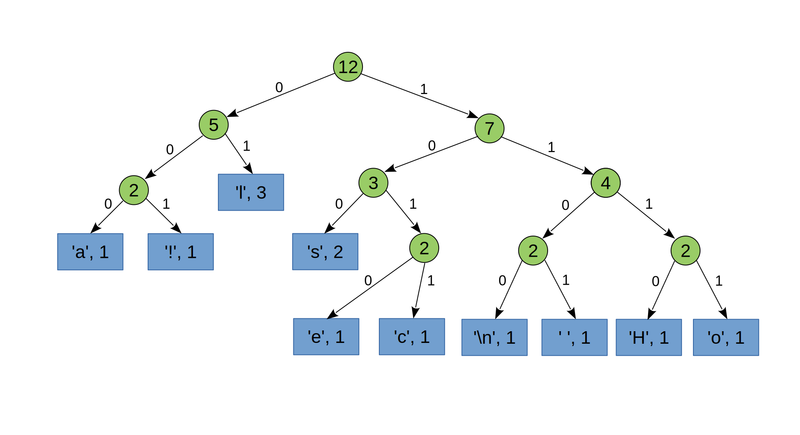

# Homework 3 (90 Points)

The deadline for Homework 3 is Tuesday, November 12, 8pm. The late
submission deadline is Monday, November 18, 8pm.

## Getting the code template

Before you perform the next steps, you first need to create your own
private copy of this git repository. To do so, click on the link
provided in the announcement of this homework assignment on
Piazza. After clicking on the link, you will receive an email from
GitHub, when your copy of the repository is ready. It will be
available at
`https://github.com/nyu-cso-005-fa19/hw03-<YOUR-GITHUB-USERNAME>`.  
Note that this may take a few minutes.

* Open a browser at `https://github.com/nyu-cso-005-fa19/hw03-<YOUR-GITHUB-USERNAME>` with your Github username inserted at the appropriate place in the URL.
* Choose a place on your computer for your homework assignments to reside and open a terminal to that location.
* Execute the following git command: <br/>
  ```git clone https://github.com/nyu-sco-005-fa19/hw03-<YOUR-GITHUB-USERNAME>.git```<br/>
  ```cd hw03-<YOUR-GITHUB-USERNAME>```

Put your solution directly into the file `src/huffman.c`.

## Submitting your solution

Once you have completed the assignment, you can submit your solution
by pushing the modified code template to GitHub. This can be done by
opening a terminal in the project's root directory and executing the
following commands in the :

```bash
git add .
git commit -m "solution"
git push
```

You can replace "solution" by a more meaningful commit message.

Refresh your browser window pointing at
```
https://github.com/nyu-cso-005-fa19/hw03-<YOUR-GITHUB-USERNAME>/
```
and double-check that your solution has been uploaded correctly.

You can resubmit an updated solution anytime by reexecuting the above
git commands. Though, please remember the rules for submitting
solutions after the homework deadline has passed.


## Huffman Coding (90 Points)

Huffman coding is an algorithm for compressing strings of
characters. In uncompressed text, each character is represented by the
same number of bits (e.g. 8 bits for ASCII characters). A Huffman
coding assigns to each character a representation of different length,
depending on whether it is common or not. Of course, a given coding is
optimal only for a single text.

A Huffman coding can be represented by a binary tree binary whose
leaves are the characters to encode. Each node contains the characters
found in the leaves below. Moreover, each character has a weight - its
number of occurrences in the text - and each node is annotated with
the total weight of the leaves underneath, which is used
during the construction of the tree. 

For example, the following is a coding tree for the string

```
Hello class!
```

where `l` has weight 3, `s` has weight `2` and all other occurring
characters have weight 1.



For a given code tree, we obtain the encoding of a character by
traversing the tree from the root to the leaf containing the
character. Along the way, every time we take a branch to the left, we append
0 to the representation and every time we take a branch to the right, we
append 1. Thus, the tree above encodes the character `'H'` as `1110` and
the character `'l'` as `01`.

Decoding a bit sequence begins at the root of the tree. We read the
bits successively from the sequence to be decoded; for each `0` we go
left, for each 1 we go right. Whenever we reach a leaf, we have
decoded the corresponding character and we begin again at the root,
continuing with the next bit in the sequence to be decoded. So the
above tree decodes the bit
sequence `111010100101` into `"Hell"`.

Our goal in this homework is to write a fully functional command line
application that encodes and decodes plain text files using Huffman
coding, by constructing an optimal coding tree for the given text file.

### Part 1: Calculating weights (15 Points)

To calculate the coding tree for a given text file that we want to
encode, we first need to calculate the weight for each ASCII character
occurring in the input file. The calculated weight is simply the
number of occurrences of the character in the input.

Write a function

```c
void count_occurrences(char* in_file_name, int* weights);
```

that reads the contents of the text file `in_file_name` and counts how
often each ASCII character occurs in the file. The counts should be
stored in the array `weights`, which should be of length `128`. That
is, you can use the ASCII characters themselves to index into the
array.

Since we need to be able to decode files after encoding them, we need
to be able to reconstruct the code tree that was used for
encoding. The information about the weights of the characters will be
sufficient to do this. Hence, write a function

```c
void write_weight_table(char* weight_file_name, int* weights);
```

That writes the weights given in the array `weights` into the file
`weight_file_name`. The generated file should have one entry per line
in the format `c:w` where `c` is an ASCII character and `w` is the
weight of that character given in `weights`. You may omit characters
whose weight is `0`. For example, if the input file to be encoded
contains the single line

```
Hello class!
```

Then the contents of the file written by `write_weight_table` should
be

```

:1
 :1
!:1
H:1
a:1
c:1
e:1
l:3
o:1
s:2
```

Note that here, the first empty line is actually the newline character
that is part of the first entry in the file. That is, the first two
lines together give the weight of the newline character.

Finally, write a function

```c
void read_weight_table(char* weight_file_name, int* weights);
```

That takes the name of a file produces by your previous function and
reads its contents back into the array `weights`.

### Part 2: Building the code tree (15 Points)

In this part, you will implement functions that construct the code
tree from the weights calculated in Part 1.

We represent the nodes of the code tree in C using the following
struct type:

```c
struct code_tree_s {
  char data;
  int weight;
  struct code_tree_s* left;
  struct code_tree_s* right;
};

typedef struct code_tree_s code_tree;
```

First, write a function

```c
code_tree* make_leaf(char c, int w);
```

that allocates a code tree node on the heap and initializes it as a
leaf node of the tree with the given character `c` and weight `w`.

Next, write a function 

```c
int weight_of_tree(code_tree* root);
```

that returns the weight of (the root of) a given tree. Then use it to
implement a function

```c
code_tree* make_fork(code_tree* l, code_tree* r);
```

that takes two code trees and combines them two a larger tree by
connecting them to a newly allocated root node to be returned by the
function. Make sure that the new root node has the correct weight.

Next, write a function 

```c
code_tree* create_code_tree(int* weights) 
```

that takes an array of `weights` and construct the code tree from
it. This can be done as follows:

1. Create a leaf node for every ASCII character with its associated
   weight. These can be viewed as a set of independent trees `T`.
   
2. Repeat the following steps until you are left with only one tree in
   `T`:

   a. Remove from `T` the two trees `t1` and `t2` that have the
      smallest weight.
      
   b. Combine `t1` and `t2` to a single tree using `make_fork`.
   
   c. Add the resulting tree back to `T`.
   
The final tree remaining in `T` is the desired code tree.

Note that the operations you need to perform on the set `T` (adding elements,
removing elements with minimal weight) correspond to those supported by
a [priority queue](https://en.wikipedia.org/wiki/Priority_queue) data
structure. We will use a priority queue implementation based on
[binary heaps](https://en.wikipedia.org/wiki/Binary_heap) for this
purpose. This implementation is already provided for you (see
`src/minheap.h`).

Finally, to clean up a heap-allocated code tree, write a function

```c
void delete_code_tree(code_tree* node);
```

that recursively traverses the tree rooted at `node` and frees all its nodes.

### Part 3: Encoding (30 Points)

To enable fast encoding of the input file into bit sequences, we
compute a code table that maps each ASCII character to its encoded bit
sequence according to the code tree computed in Part 2. There are 128
ASCII characters. Hence, the depth of the code tree can also be at
most 128 in the worst case. We therefore need at most 127 bits to
encode a single character. These can be packed into 16 bytes,
represented by `unsigned char` values. This suggests the following
struct type definition for the entries in our code table:

```c
struct code_s {
  unsigned char bits[16];
  int len;
};

typedef struct code_s code; 
``` 

The code table is then an array of `code` values of length 128 - one
per ASCII character. Here, the array `bits` for the entry of a
character `c` stores the bit sequence
encoding `c` according to the code tree and `len` stores how many bits of the
array are actually used for `c`'s code. We suggest to store the
highest 8 bits of `c`'s code in `bits[0]` the next 8 bits in `bits[1]`
if `len > 8`, etc. Essentially, use a big endian representation of the
bit sequence.

Write a function

```c
void create_code_table(code_tree* root, code* tbl)
```

that takes the `root` of the code tree computed in Part 2 and a
pointer `tbl` to the first element of the pre-allocated code table
array. The function should then traverse the tree and populate `tbl`
with the appropriate entries. Feel free to introduce an auxiliary
helper function for the traversal as you see fit.

For example, for the code tree shown above, this function would
populate the following entries in the table (the given sequence would
be produced by an in-order traversal of the tree):

```c
tbl[97]  -> bits[0] = 0x00, len = 3 // c = 'a'
tbl[33]  -> bits[0] = 0x20, len = 3 // c = '!'
tbl[108] -> bits[0] = 0x40, len = 2 // c = 'l'
tbl[115] -> bits[0] = 0x80, len = 3 // c = 's'
tbl[101] -> bits[0] = 0xa0, len = 3 // c = 'e'
tbl[99]  -> bits[0] = 0xb0, len = 4 // c = 'c'
tbl[10]  -> bits[0] = 0xc0, len = 4 // c = '\n'
tbl[32]  -> bits[0] = 0xd0, len = 4 // c = ' '
tbl[72]  -> bits[0] = 0xe0, len = 4 // c = 'H'
tbl[111] -> bits[0] = 0xf0, len = 4 // c = 'o'
```

We only show the lowest byte of `bits` here since we need at most 4
bits to encode all characters represented in this tree.

Next, write a function 

```c
void encode(char* in_file_name, char* out_file_name, code* tbl);
```

That takes as input the name `in_file_name` of the file from which the
code tree was constructed, the name `out_file_name` where the result
of the encoding is to be stored, and the computed code table
`tbl`. This function should then read the contents of `in_file_name`
compute its encoding according to the computed code table, and write
it out byte-by-byte into the file `out_file_name` . Note that you need
to pack the codes of the encoded characters into bytes so that they
form a continues bit stream. For instance, if the input file contains

```c
Hello class!
```

and the code table is as above, then the first byte written out to the
output file should be `0xea`, encoding the first two characters `He`
of the input. The second byte would be `0x5f` encoding the next three
characters `llo`, etc. Note that the code of one character may span
multiple bytes in the output.

The final byte of the encoded output bit stream may not be
fully utilized by the code of the final character in the input
file. The remaining unutilized bits of that byte should be set
to 0. In order to be able to distinguish these "fill bits" from the
codes of characters that belong to the encoded bit stream, we
terminate the output file with a single byte that stores the number of
bits being utilized in the last byte of the encoded bit stream.

For instance, the complete byte sequence of the encoding of the input
above is:

```c
ea 5f db 44 87 00 02
```

Here the final byte `02` indicates that only the first 2 bits of the
preceding byte `00` are still part of the encoding (these are the
final two bits of the code `1100` for the final newline character in
the input.

Note that the output generated by your implementation may differ from
the above as it depends on how the generated code tree looks
like. There is no unique optimal code tree for a given input file.
The generated code tree will depend on the order in which you combine the
subtrees during the construction of the tree.

#### Hints

* Since we are generating a binary file for the encoding, you should open
  the file `out_file_name` in *binary writing mode*, which you can do by
  passing the mode string `"wb"` to the function `fopen` when opening
  the file.

* You can use the function `putc(c, file)` to write a single byte `c`
  (i.e. unsigned char) into the file `file`. Execute
  
  ```bash
  $ man putc
  ```
  
  on the command line for more information about `putc`.

* To read the contents of the generated binary files when debugging
  your code, we suggest to use the command line tool `od`. For
  instance, suppose that the output file for the encoded bit stream is
  `out.bin`. Then execute
  
  ```bash
  $ od -t x1 out.bin
  ```
  
  to obtain a dump of the contents of the file as a sequence of
  hexadecimal values encoding the contained sequence of bytes. Again,
  use
  
  ```bash
  $ man od
  ```
  
  on the command line for more information about `od`.


### Part 4: Decoding (20 Points)

Decoding is simpler than encoding. Write a function

```c
void decode(char* in_file_name, char* out_file_name, code_tree* root);
```

that takes `in_file_name` which is now the name of the file
containing the encoded bit stream, `out_file_name` which is the name
of the file where the decoded plain text is to be written to, and
`root` which is the root of the code tree that was used for generating
`in_file_name`.

The function should read in the contents of the file `in_file_name`, decode
the contained bit sequence according to the given code tree, and write
the decoded characters into the file `out_file_name`. Be careful that
you detect in advance when the final byte of the input file is reached
in order to know how many bits of the preceding byte are still part of
the encoding. You should read the input file only once, not multiple
times, and decode it on the fly.

Similar to `encode`, open the file in *binary read mode*, which can be
done by passing the mode string `"rb"` to `fopen`. To read the
contents of the binary file containing the encoding, use the function
`fread`. For instance, if `file` is the pointer to the opened binary
file, `buf` is an array of (unsigned) `char` values of size `SIZE`,
then

```c
fread(buf, 1, SIZE, file)
```

will read up to `SIZE` bytes from `file` and store them in `buf`. The
return value of the function is the actual number of bytes being
read. A return value smaller than `SIZE` indicates that the end of the
file has been reached. Again, for more information execute

```bash
$ man fread
```

Feel free to introduce auxiliary function for implementing the
traversal of the code tree for the actual decoding.

### Part 5: Putting it all together (10 Points)

Finally, we put all the pieces together by implementing a `main`
function for our command line application. The application should
support two modes:

```bash
$ ./huffman -e input.txt -w key.txt -o out.bin
```

Should read `input.txt`, generate the associated weight table in
`key.txt` and encode the contents of `input.txt` according to the
constructed code tree in the output file `out.bin`.

Conversely

```bash
$ ./huffman -d out.bin -w key.txt -o output.txt
```

should read in the weight table from `key.txt`, construct the code
tree, use it to decode the contents of `out.bin`, and write the
decoded ASCII sequence into the file `output.txt`.

Executing these two commands in sequence should produce an exact copy of
`input.txt` in `output.txt`. You can use the `diff` command to check
that the two files are identical.

Write an appropriate `main` function that implements this
functionality. Make sure that your implementation handles invalid
command line options robustly. E.g. detect missing command line
arguments, make sure that the options `-e` and `-d` are not used
together, etc.

To simplify the parsing of command line arguments, We suggest to use
the `getopt` function. Execute

```bash
$ man 3 getopt
```

for more information or
see
[this short tutorial](https://www.gnu.org/software/libc/manual/html_node/Getopt.html#Getopt).

Don't forget to properly clean up after yourself (free all heap
allocated data, close opened files, etc.).

### Compiling your code

The repository contains a `CMakeLists.txt` for compiling your
code. Run

```bash
$ cmake .
```

once. Then compile your code with


```bash
$ make
```

Alternatively, import the project into an IDE such as CLion and
compile/run from there.

